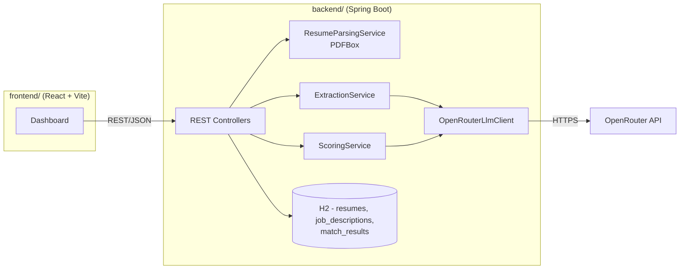
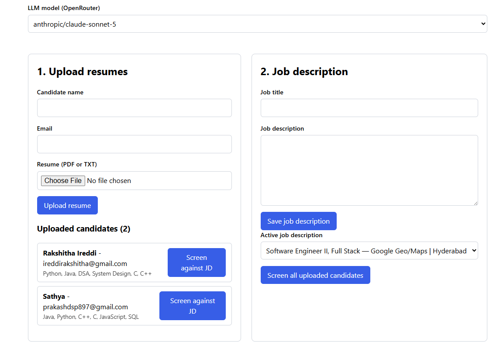

# Smart Resume Screener

Parses résumés (PDF/text), extracts structured candidate data via an LLM, and scores each
candidate's fit against a job description (1-10, with justification) so recruiters can see
a ranked, explainable shortlist.

Built for the "Smart Resume Screener" assignment. See [`docs/adr/`](docs/adr) for the
reasoning behind every non-obvious technical decision.

## Architecture



**Flow:** upload a résumé → PDFBox extracts raw text → LLM extracts structured
`{skills, experience, education}` → both are stored → pick a job description → LLM compares
résumé + job description → `{score, justification}` is stored → the shortlist endpoint
returns candidates for a job description ordered by score, optionally filtered by a minimum
score.

## Tech stack

| Layer | Choice | Why |
|---|---|---|
| Backend | Java 17 + Spring Boot 3.3 (Maven) | [ADR 0001](docs/adr/0001-backend-language-and-framework.md) |
| LLM access | OpenRouter, model chosen per request | [ADR 0002](docs/adr/0002-llm-gateway-openrouter.md) |
| Storage | Embedded H2 (file-backed), Spring Data JPA | [ADR 0003](docs/adr/0003-embedded-storage-h2.md) |
| PDF parsing | Apache PDFBox | [ADR 0004](docs/adr/0004-pdf-parsing-apache-pdfbox.md) |
| Extraction approach | LLM-based (not regex/NER) | [ADR 0005](docs/adr/0005-llm-based-structured-extraction.md) |
| Testing | JUnit 5 + Mockito + MockMvc, LLM mocked | [ADR 0006](docs/adr/0006-testing-strategy.md) |
| Frontend | React + Vite, no UI kit / router / axios | [ADR 0007](docs/adr/0007-frontend-react-vite-minimal-dependencies.md) |

## Project structure

```
backend/    Spring Boot API (src/main, src/test)
frontend/   React + Vite dashboard (src, tests)
docs/adr/   Architecture Decision Records
.github/workflows/ci.yml   Runs backend + frontend tests on every push/PR
```

## Setup

### Prerequisites
- JDK 17+
- Maven 3.9+ (or use your IDE's bundled Maven)
- Node.js 18+ and npm
- An [OpenRouter](https://openrouter.ai/) API key

### Backend

```bash
cd backend

# Windows PowerShell
$env:OPENROUTER_API_KEY = "sk-or-..."
# macOS/Linux
export OPENROUTER_API_KEY="sk-or-..."

mvn spring-boot:run
```

Runs on `http://localhost:8080`. Optional env vars (see `application.yml`):

| Variable | Default | Purpose |
|---|---|---|
| `OPENROUTER_API_KEY` | *(required)* | Your OpenRouter API key |
| `OPENROUTER_DEFAULT_MODEL` | `openai/gpt-4o-mini` | Model used when a request doesn't specify one |
| `OPENROUTER_BASE_URL` | `https://openrouter.ai/api/v1` | Override for testing against a different gateway |
| `OPENROUTER_TIMEOUT_SECONDS` | `60` | HTTP timeout for LLM calls |
| `FRONTEND_ORIGIN` | `http://localhost:5173` | Allowed CORS origin |

### Frontend

```bash
cd frontend
npm install
cp .env.example .env    # adjust VITE_API_BASE_URL if the backend isn't on localhost:8080
npm run dev
```

Runs on `http://localhost:5173`.

### Running tests

```bash
cd backend && mvn test      # unit + integration tests, JaCoCo coverage report in target/site/jacoco
cd frontend && npm test     # component + API-client tests (Vitest)
```

No tests call the real OpenRouter API - the LLM client is mocked everywhere except
`OpenRouterLlmClientTest`, which runs against a local stub HTTP server. See
[ADR 0006](docs/adr/0006-testing-strategy.md).

## API reference

| Method | Path | Purpose |
|---|---|---|
| `POST` | `/api/resumes` | Upload a résumé (`multipart/form-data`: `file`, `candidateName`, `email`, optional `model`) → parses + extracts + stores it |
| `GET` | `/api/resumes` | List all uploaded résumés with their extracted data |
| `GET` | `/api/resumes/{id}` | Fetch one résumé |
| `POST` | `/api/job-descriptions` | Create a job description (`{title, rawText}`) |
| `GET` | `/api/job-descriptions` | List job descriptions |
| `GET` | `/api/job-descriptions/{id}` | Fetch one job description |
| `POST` | `/api/screenings` | Score a résumé against a job description (`{resumeId, jobDescriptionId, model?}`) |
| `GET` | `/api/screenings/shortlist?jobDescriptionId=&minScore=` | Ranked shortlist for a job description, highest score first |
| `GET` | `/api/models` | Suggested OpenRouter model slugs + the configured default, for the frontend picker |

### Sample: upload + extract

Real output from a live run against OpenRouter (`openai/gpt-4o-mini`) - not a fabricated example:

```bash
curl -X POST http://localhost:8080/api/resumes \
  -F "file=@ananya_rao_resume.txt" \
  -F "candidateName=Ananya Rao" \
  -F "email=ananya.rao@example.com"
```

```json
{
  "id": 1,
  "candidateName": "Ananya Rao",
  "email": "ananya.rao@example.com",
  "fileName": "resume_strong.txt",
  "extractedData": {
    "skills": ["Java", "Spring Boot", "Spring Data JPA", "REST APIs", "PostgreSQL", "MySQL", "Docker", "AWS ECS", "JUnit 5", "Testcontainers", "Jenkins", "Git", "Kafka (basic)"],
    "experience": ["Senior Backend Engineer at Fintech Solutions Pvt Ltd (2022 - Present)", "Backend Engineer at Initech Systems (2020 - 2022)"],
    "education": ["B.E. in Computer Science, RV College of Engineering (2016 - 2020)"]
  },
  "createdAt": "2026-08-24T10:49:30Z"
}
```

### Sample: score + shortlist

Same live run, scored against a "Backend Engineer" job description requiring Java/Spring Boot,
a relational database, Docker/AWS, and automated testing:

```bash
curl -X POST http://localhost:8080/api/screenings \
  -H "Content-Type: application/json" \
  -d '{"resumeId": 1, "jobDescriptionId": 1}'
```

```json
{
  "id": 1,
  "resumeId": 1,
  "jobDescriptionId": 1,
  "score": 10,
  "justification": "The candidate has 4 years of experience building REST APIs in Java and Spring Boot, which exceeds the 3+ years requirement. They have hands-on experience with both PostgreSQL and MySQL, as well as Docker and AWS for cloud deployment. Their use of JUnit 5 and Testcontainers for automated testing aligns perfectly with the job's requirements, and they have experience with CI/CD pipelines using Jenkins. Additionally, the candidate's basic knowledge of Kafka meets the desired familiarity with messaging systems.",
  "modelUsed": "openai/gpt-4o-mini",
  "createdAt": "2026-08-24T10:49:41Z"
}
```

A second, deliberately mismatched candidate (a frontend developer's résumé) scored against the
same job description in the same run, to confirm the model actually differentiates rather than
scoring everyone highly:

```json
{
  "score": 2,
  "justification": "The candidate has strong frontend development skills with experience in JavaScript, React, and Next.js, but lacks the required backend experience in Java and Spring Boot, as well as experience building REST APIs. Additionally, there is no mention of relational databases, Docker, cloud deployment, or automated testing practices relevant to the backend role, which are critical for the position.",
  "modelUsed": "openai/gpt-4o-mini"
}
```

The resulting shortlist (`GET /api/screenings/shortlist?jobDescriptionId=1`) correctly ranks the
matching candidate first:

```json
[
  { "candidateName": "Ananya Rao",  "score": 10, "modelUsed": "openai/gpt-4o-mini" },
  { "candidateName": "Rohit Mehta", "score": 2,  "modelUsed": "openai/gpt-4o-mini" }
]
```

## LLM prompts

Both prompts require the model to return **only** a JSON object; the app is defensive about
this (`JsonExtractionUtil`) rather than trusting it blindly, since not every OpenRouter model
honors "JSON only" equally strictly. See [ADR 0005](docs/adr/0005-llm-based-structured-extraction.md).

### Extraction prompt (`ExtractionService`)

**System:**
```
You are an expert résumé parser used inside an applicant tracking system.
You read raw résumé text (which may contain messy PDF extraction artifacts,
inconsistent spacing, or OCR noise) and return ONLY a single JSON object -
no markdown, no code fences, no commentary before or after it.
```

**User:**
```
Extract structured data from the résumé below.

Return ONLY valid JSON with exactly this shape:
{
  "skills": string[],       // technical & professional skills, deduplicated, no ratings
  "experience": string[],   // one entry per role, e.g. "Senior Engineer at Acme Corp (2021-2024)"
  "education": string[]     // one entry per qualification, e.g. "B.Tech Computer Science, XYZ University (2017-2021)"
}

If a section is not present in the résumé, return an empty array for it. Do not invent data.

Résumé text:
---
{resumeText}
---
```

### Scoring prompt (`ScoringService`)

Directly implements the assignment's example prompt ("Compare the following resume with
this job description and rate fit on 1-10 with justification"), extended with a strict
output schema and the already-extracted skills/experience for grounding:

**System:**
```
You are an expert technical recruiter. You objectively compare a candidate's résumé
against a job description and score how well the candidate fits the role.
You return ONLY a single JSON object - no markdown, no code fences, no commentary.
Be specific in your justification: reference concrete skills or experience that
matched or were missing, rather than generic praise.
```

**User:**
```
Compare the following résumé with this job description and rate the fit on a
scale of 1 to 10, with justification.

Return ONLY valid JSON with exactly this shape:
{
  "score": <integer 1-10>,
  "justification": "<2-4 sentence explanation citing specific matches or gaps>"
}

Extracted skills: {skills}
Extracted experience: {experience}

Full résumé text:
---
{resumeText}
---

Job description:
---
{jobDescriptionText}
---
```

## Dashboard



*(Screenshot: run `npm run dev` in `frontend/` and `mvn spring-boot:run` in `backend/`, open
`http://localhost:5173`, run through an upload → job description → screening flow, then save a
screenshot to `docs/screenshots/dashboard.png` - it'll render above automatically once committed.)*

The dashboard has three panels: an upload form (candidate name, email, résumé file, and the model
selector) on the left, a job description form and active-JD picker on the right, and a ranked
shortlist table with a minimum-score filter across the bottom.

## Trying different models

The model selector (and the `model` field on the upload/screening APIs) accepts any OpenRouter
model slug - the app doesn't hardcode a single provider. `GET /api/models` returns these
suggested slugs (verified live against OpenRouter as of this writing) plus the configured
default, but the picker also accepts free text for any other slug from
[openrouter.ai/models](https://openrouter.ai/models):

- `openai/gpt-4o-mini` (default)
- `openai/gpt-4o`
- `anthropic/claude-sonnet-5`
- `anthropic/claude-haiku-4.5`
- `meta-llama/llama-3.1-70b-instruct`
- `google/gemini-3.5-flash`

**Real cross-model comparison**, same résumé and job description, two different models:

| Model | Score | Justification |
|---|---|---|
| `openai/gpt-4o-mini` | 2 | "The candidate has strong frontend development skills with experience in JavaScript, React, and Next.js, but lacks the required backend experience in Java and Spring Boot, as well as experience building REST APIs. ..." |
| `anthropic/claude-haiku-4.5` | 2 | "Rohit is a frontend specialist with React, Next.js, and Tailwind CSS expertise, but the role requires a backend engineer proficient in Java and Spring Boot—technologies entirely absent from his résumé. ... His 3 years of experience matches the duration requirement, but the technical stack mismatch is fundamental and disqualifying." |

Both models converged on the same score with independently-written justifications - useful
signal that the scoring prompt is model-agnostic rather than tuned to one provider's quirks.
